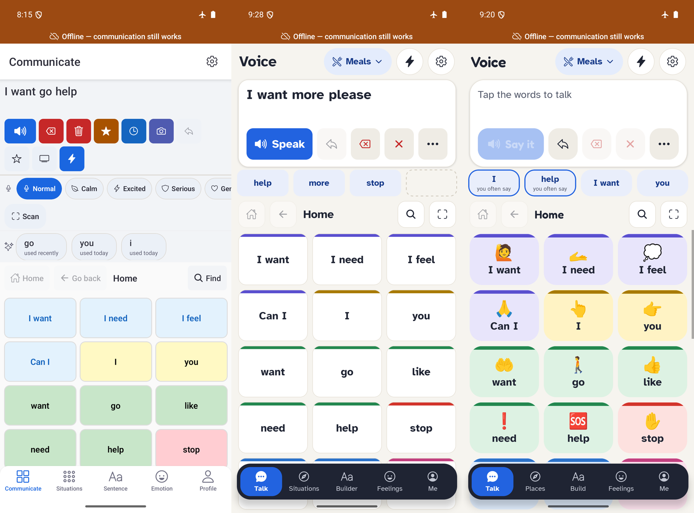
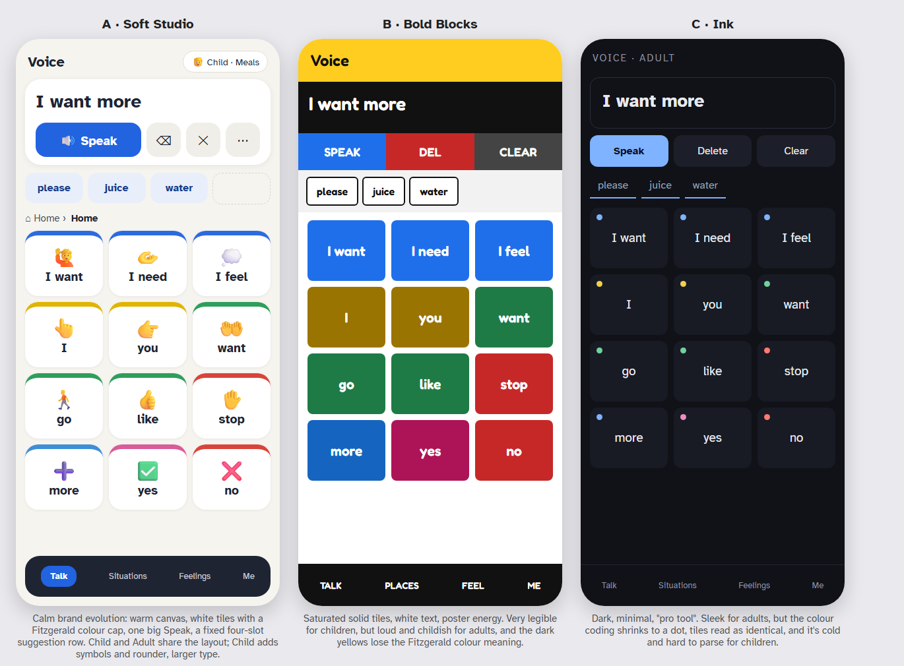
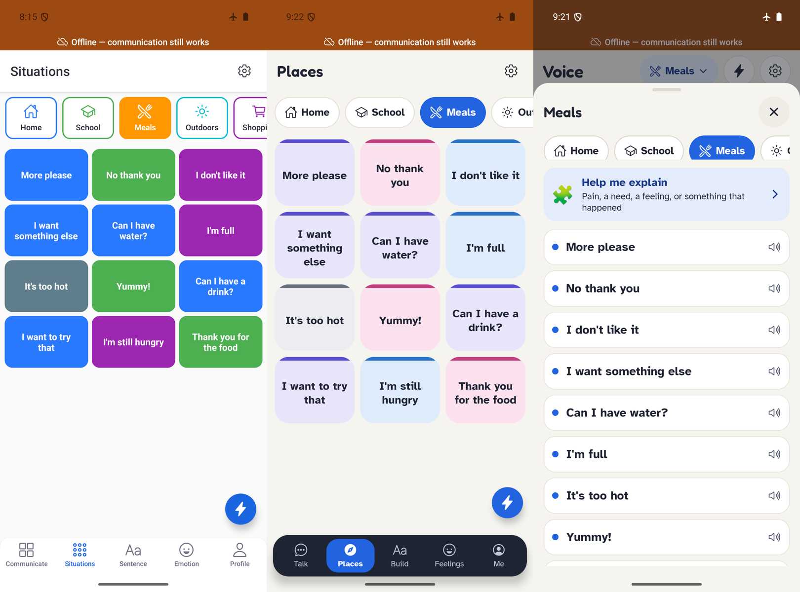
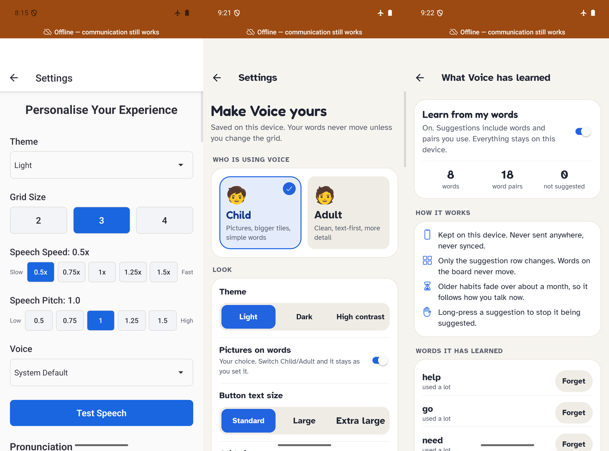
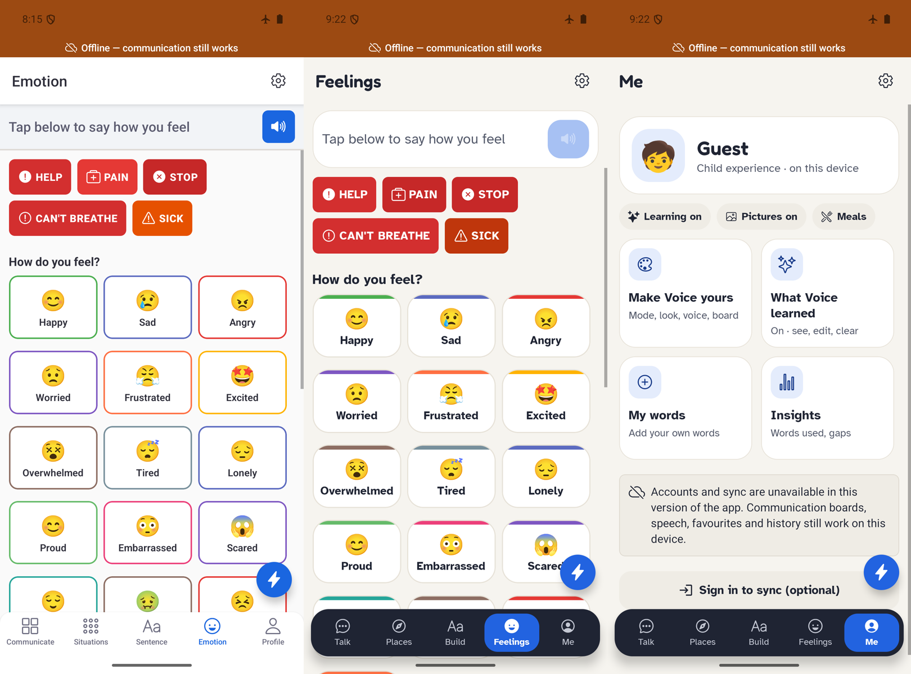

# Voice redesign: Soft Studio, Child and Adult (October 2026)

Branch `voice-transformation`, built on PR #7 (`1d02930`), whose reliability fixes it
keeps. The screenshots are from the Android 15 emulator (Pixel 7 profile, offline),
using the separate test app built from this branch.

*Left: before (1d02930). Middle: Adult. Right: Child. Same words, same places.*

## The brief, as applied
No written brief was available in this session, so these defaults were agreed and used:

| Area | Default applied |
|---|---|
| Accessibility | WCAG 2.2 AA contrast, touch targets of at least 48dp, PR #7's board and font-size fixes kept. Contrast is enforced by `theme.test.js` for every theme |
| Privacy | Learning stays on the device, is off until turned on, and can be seen, edited and cleared. Nothing learned goes to Firebase or analytics |
| Data | Existing boards, vocabulary, favourites, history and settings are kept. Earlier learned data is migrated without changing its original fields. No word moves |
| Licensing | Only assets already in the repo, plus clearly open-licensed new ones with attribution |
| Help me explain | Offline and template-based, with no cloud AI |

## Three directions, one chosen

- **A · Soft Studio (chosen).** Builds on the brand guide ("calm, friendly, not
  childish, not clinical"): a warm canvas, white rounded tiles with a Fitzgerald colour
  cap, and one big Speak button. It is the only direction that serves a child and an
  adult with **the same layout**, so a mode switch never breaks a motor plan.
- **B · Bold Blocks.** Very legible for children, but loud and childish for adults. The
  darkened yellows needed for white text lose the Fitzgerald colour meaning.
- **C · Ink.** Sleek for adults, but the colour coding shrinks to a dot, tiles read as
  identical, and it is cold and hard to parse for children.

The mockup source is `three-directions.html`.

## Design rules
1. **Words never move.** Child, Adult, pictures, suggestions, panels and situations
   change appearance only.
   - Tile height (`TILE_HEIGHT`), columns and order are shared by both modes.
   - Panels open as sheets over the board.
   - The suggestion row is fixed: four slots, fixed height, no scrolling.
   - Verified natively: identical tile bounds for Adult and Child, for pictures off and
     on, and for empty, long and cleared messages. Only *Grid size* rearranges the board,
     and it says so.
2. **Colour carries meaning.** Every tile shows its Fitzgerald colour as a cap. Caps are
   at least 3:1 against the tile, Child tints keep labels at 7:1 or better (AAA), and
   high contrast keeps the caps.
3. **Readable type.** Atkinson Hyperlegible (Braille Institute, designed for low vision)
   everywhere. Fredoka gives Child headings a friendlier feel. Both are OFL-1.1 and
   embedded at build time, so they work offline from the first frame.
4. **Tap-only, explainable suggestions.** Learned suggestions are outlined and say why
   ("you often say", "you said this before"). Long-press means "don't suggest this".

## Child and Adult
|  | Child | Adult |
|---|---|---|
| Tiles | Tinted Fitzgerald fill, 22dp corners | White tile with colour cap, 14dp corners |
| Pictures | On by default | Off by default |
| Wording | "Say it", "Tap the words to talk", short Help me explain questions | "Speak", fuller and more precise wording |
| Headings | Fredoka | Atkinson Hyperlegible Bold |
| Tabs | Talk · Places · Build · Feelings · Me | Talk · Situations · Builder · Feelings · Me |

Mode is chosen in onboarding or in **Settings › Who is using Voice**. Switching asks for
confirmation ("Every word stays in the same place").

**Pictures** use the device's emoji font. They work offline, need nothing bundled or
licensed, and are hidden from screen readers because the tile label already says the
word. Little words such as "the" and "is" stay text-only, and every folder and noun has
a picture (tested). A dedicated AAC symbol set, such as Mulberry Symbols (CC BY-SA),
could replace the map in `src/data/symbols.js` later without touching the board.

## What changed, screen by screen
| Area | Change |
|---|---|
| Board | Header with name, situation chip, quick phrases and settings. A message card with Speak, Undo, Delete, Clear and More, always in that order. The fixed four-slot suggestion row. An icon page row (Home, Back, Find, Scan). Favourites and history open as sheets from **More** |
| Situations | The chip on the board opens a panel of that situation's phrases, plus **Help me explain**. The Situations tab shares the same chosen situation |
| Help me explain | Topics: pain, a need, a feeling, something happened, not understanding. Each has 1–4 tap-only questions; all but the first can be skipped. A preview, then **Use** (puts it in the message bar) or **Say it now**. Never spoken automatically |
| Learning | Opt-in; the details are in [docs/ai/prediction-evaluation.md](../../ai/prediction-evaluation.md). **What Voice has learned** offers per-word Forget, Undo for each "don't suggest", and Clear all |
| Settings | Grouped cards: Who is using Voice, Look, Voice, Pronunciation, Board, Switch access, Learning and privacy, About. Every switch row is now tappable across its full width (before, only the small switch responded). All accessibility labels kept |
| Onboarding | Three skippable steps: who is using Voice, "your words stay put", and "private by default" with the learning switch (off) |
| Me | A personalisation hub: mode, status (learning, pictures, situation), Make Voice yours, What Voice learned, My words, Insights, Sign in |
| Feelings | Restyled. White text on teal, light blue, green and amber chips measured 2.4–3.8:1; the chips are now light with dark text, and the crisis reds were darkened to pass 4.5:1 |
| Navigation | A floating dark tab bar. Pushed screens no longer show an empty status-bar-high band under the offline banner, a defect present before this work |

## Screens
Before (`screens/before-*`) and after (`screens/after-*`), downscaled to 540px.

| After | |
|---|---|
| Help me explain | `after-13` topics, `after-14` question, `after-15` preview, `after-16` message bar |
| Themes and sizes | `after-18` dark, `after-19` high contrast, `after-20` compact, `after-21` system font 2.0 |
| Onboarding | `after-22` to `after-24` |
| Pictures off/on (same positions) | `after-25`, `after-26` |

## Verification
- **Jest: 274 tests pass.** New tests cover the prediction engine, the evaluation,
  personal learning and settings migration, Help me explain, symbols, and theme contrast
  for the new tokens and Fitzgerald caps.
- **Native suite (`scripts/native-ui/`), on the emulator with real TTS and permissions:**
  - **Upgrade in place:** installed over the PR #7 test app holding real test data.
    Favourites, history, speech speed 0.5× and learned words all survived, and learning
    stayed on for that existing learner.
  - **Regression suite:** 40/40 checks pass after updating it for the More menu (board,
    history, settings, compact, fonts, speech, camera, persistence).
  - **Live font-size scripts:** 13/13 pass.
  - **Fresh install:** onboarding shows, learning is off by default, and the first
    suggestions are the built-in starters.
- **Lint:** 0 errors. The 14 warnings were all present before this work (one was removed).

## Known limits and follow-ups
- **Simulated evaluation only.** The prediction numbers come from simulated users. A
  real evaluation needs consented logging with AAC users and their therapists.
- **Screen readers and switches not checked by a person.** No TalkBack, VoiceOver or
  physical-switch session was run. Labels, roles and the scan order (vocab → suggestions
  → actions) are unchanged in structure, but a person should check them.
- **Bundled neural model does not load in release builds.** Logcat:
  `Error reading resource assets_tf_model_..._group1shard1of1.bin`; the release build
  renames resource files. The loading code is unchanged from 1d02930, so it very likely
  affects PR #7's builds too. Suggestions do not depend on it.
- **Builder tab not redesigned.** The Sentence Builder (online ARASAAC pictograms)
  inherits the new colours but keeps its old layout and type.
